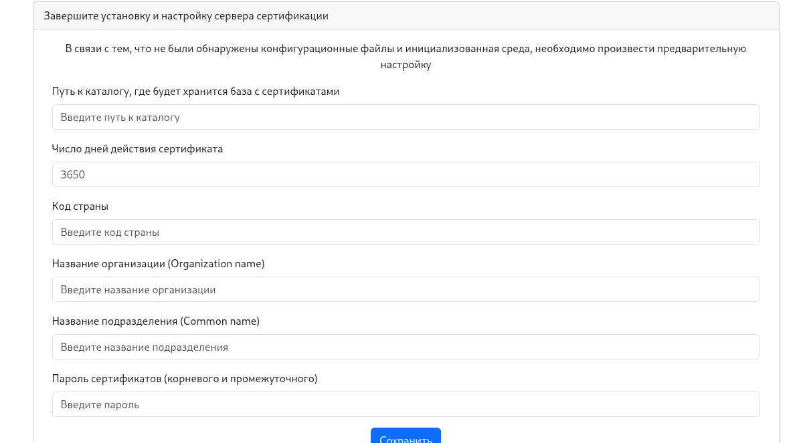
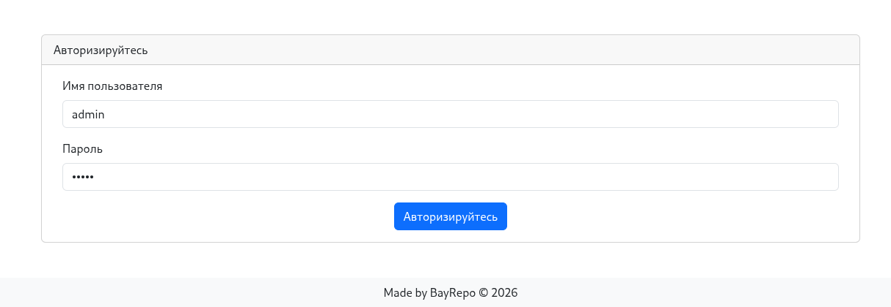
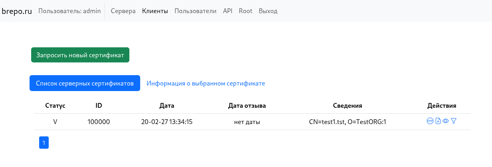
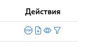
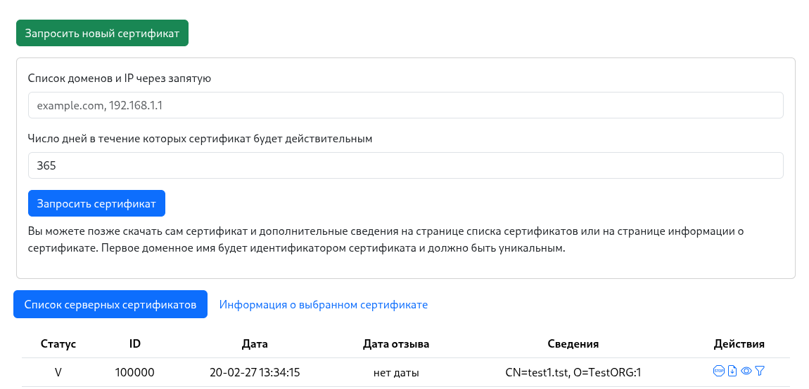
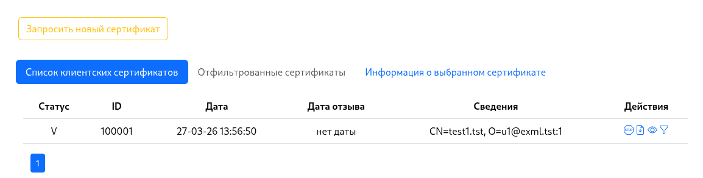
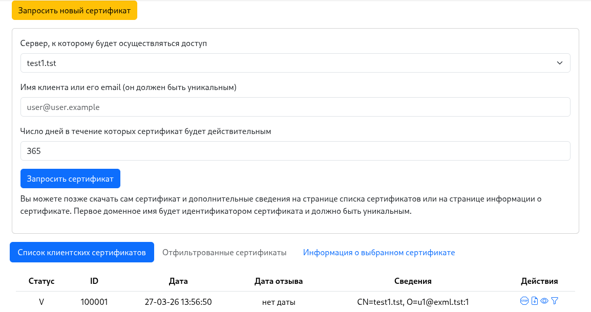

# Ce_rtificate Ce_nter Ma_nagement Ut_ility (CeCeMaUt)

Набор утилит и графический интерфейс написанный на Ruby с использованием Sinatra

В первую очередь программный комплекс направлен на упрощение работы с центром сертификации и openssl утилитой, которая обладает очень богатым функционалом.

Что позволяет cecemaut:

- организовывает струкутру центра сертификации (корневой сертификат, промежуточный и последубщие сертификаты)
- предоставляет набор утилит bash для создания структуры и выпуска новых сертификатов
- предоставляет GUI для управления и выпуском сертификатами через браузер
- предоставляет API для управления центром сертификации с помощью утилит командной строки
- так же предоставляет упрощеная система аутентификации, для разграничения ролей по работе с сертификатами

# Установка

## Использование только скриптов

В данном случае не требуется установка ruby и прочих пакетов, кроме openssl и bash. Для управления используются только скрипты

- `git clone https://github.com/bayrepo/cecemaut.git`
- `cd cecemait`
- `cd utils`
- создайте файл `custom_config.sh`  с содержимым:

```
ROOT_DIR="[полный путь к будущему хранилищу сертификатов, желательно пустой каталог]"
COUNTRY_NAME="[двухбуквенный код страны]"
ORG_NAME="[название организации]"
COMM_NAME="[дополнительное название организации]"
SERT_PASS="[пароль для корневого и промежуточного сертификатов]"
VAL_DAYS="[число дней действия корневого сертификата]"
```
- далее запустите скрипт `bash prepare.sh`, в случае успеха структура каталогов будет подготовлена и созданы необходимые сертификаты
- для дальнейшей работы сделаны отдельные скрипты в папке `utils`, которые описаны в [документации](docs/UTILS_EXAMPLES.md)

## Установка веб-сервиса

### Вручную для RPM based систем (на примере AlmaLinux 9)

Для работы сервиса необходимо наличие ruby 3.3. Его можно установить с помощью rvm как описано в Dockerfile или с помощью альтернативной версии пакета ruby, если системный ruby версии 3.3 как в Fedora 41, то данный шаг можно пропустить.

Установка альтернативного пакета ruby 3.3 на AlmaLinux 9:

- Подключаем репозиторий где есть альтернативный ruby:

```
echo -e "[brepo_projects]
name=brepo_projects
skip_if_unavailable=True
baseurl=https://repo.brepo.ru/hestia/
enabled=1
gpgkey=https://repo.brepo.ru/hestia/brepo_projects-gpg-key
gpgcheck=1" > /etc/yum.repos.d/brepo_projects.repo
```
правда только для AlamaLinux 9/RockyLinux 9/CentOS 9 работает, в других случаях лучше использовать rvm или прочие возможности переключения ruby.

- устанавливаем пакет: `sudo yum install alt-brepo-ruby33 alt-brepo-ruby33-devel`
- подключаем репозиторий crb: `sudo dnf config-manager --set-enabled crb`
- доустанавливаем пакеты, необходимые для работы программы: `sudo yum install -y curl git gnupg2 gcc gcc-c++ patch readline-devel zlib-devel libyaml-devel libffi-devel openssl-devel ruby ruby-devel`
- `git clone https://github.com/bayrepo/cecemaut.git`
- `cd cecemait`
- выполните команду для создания ключей приложения: `bash utils/make_app_keys.sh .`
- выполните команду для установки необходимых гемов (все ставится в локальный каталог): `/opt/brepo/ruby33/bin/bundle install`
- создайте базу данных: `/opt/brepo/ruby33/bin/bundle exec sequel -m migration sqlite://db/base.sqlite`
- файлы конфигурации находятся в файле `classes/config.rb`, но если нужно что-то переопределить, например на какой IP адрес приложению прицепиться или количество записей на странице или прочее, то рекомендуетя создать файл `classes/config_custom.rb`, где можно переопределить стандартные значения констант:

```
PER_PAGE = 30 #число записенй на страницу
LIFE_TOKEN = 300 # время жизни токена в секундах
ALLOWED_IPS = [
  # Example: '192.168.1.10',
  # Add allowed IP addresses here
  '*'
] # список IP с которых возможен доступ к веб-интерфейсу или '*' когда доступ возможен отовсюду
PORT = 4567 # порт, к которому прицепляется приложение
IPBIND = '0.0.0.0' #IP к которому прицепляется приложение
```

Вот пример config_custom.rb, который меняет привязку к 127.0.0.1:

```
IPBIND = '127.0.0.1'
```

- теперь можно запускать приложение: `/opt/brepo/ruby33/bin/bundle exec /opt/brepo/ruby33/bin/ruby app.rb`
- и не забудьте открыть порт на фаерволе для доступа к приложению

### Создание docker-образа

Для создания и запуска образа docker необходимо выполнить следующее:

- установить сам докер
- `git clone https://github.com/bayrepo/cecemaut.git`
- `cd cecemait`
- файлы конфигурации находятся в файле `classes/config.rb`, но если нужно что-то переопределить, например на какой IP адрес приложению прицепиться или количество записей на странице или прочее, то рекомендуетя создать файл `classes/config_custom.rb`, где можно переопределить стандартные значения констант:

```
PER_PAGE = 30 #число записенй на страницу
LIFE_TOKEN = 300 # время жизни токена в секундах
ALLOWED_IPS = [
  # Example: '192.168.1.10',
  # Add allowed IP addresses here
  '*'
] # список IP с которых возможен доступ к веб-интерфейсу или '*' когда доступ возможен отовсюду
PORT = 4567 # порт, к которому прицепляется приложение
IPBIND = '0.0.0.0' #IP к которому прицепляется приложение
```
Для сборки docker-контейнера не рекомендуется переопределять IPBIND или PORT, т.к в этом случае нужно править и Dockerfile, а вот остальные параметры - по усмотрению

- собрать докер образ, займет некоторое время, т.к происходит сборка руби: `docker build -t certcenter:latest .`
- подготовить каталои для журнала и сертификатов, для примера: `mkdir -p /opt/ca /opt/logs`, ини должны быть доступны для записи контейнером
- запуск: `docker run -d --name certcenter -p 9090:4567 -v /opt/ca:/opt/cert/certcenter/ca -v /opt/logs:/opt/cert/certcenter/logs сertcenter:latest`

# Работа с веб-сервисом

## Первый запуск

при первом обращении к приложению (вызов страницы через браузер по адресу, например http://127.0.0.1), приложение попросит ввести данные о центре сертификации, это делается один раз и далее эту ифнормацию изменить нельзя, разве, что руками или с помощью openssl утилиты. Или можно очистить каталог с сертфикатами и удалить файл `utils/custom_config.sh`. Вот как выглядит страница:



Необходимо заполнить поля в форме, эти значения будут сохранены в файле `utils/custom_config.sh`:

```
ROOT_DIR="[полный путь к будущему хранилищу сертификатов, желательно пустой каталог]"
COUNTRY_NAME="[двухбуквенный код страны]"
ORG_NAME="[название организации]"
COMM_NAME="[дополнительное название организации]"
SERT_PASS="[пароль для корневого и промежуточного сертификатов]"
VAL_DAYS="[число дней действия корневого сертификата]"
```

Если установка происходит на приложении из Docker контейнера, то путь к каталогу с сертификатами должен быть: `/opt/cert/certcenter/ca`, если приложение запущено не из контейнера, то путь должен быть полным и доступным для приложения, например: `/home/test1/ca`, время действия корневого сертификата 10 лет, примерно 3650 дней, код страны пусть будет "RU", название организации пусть будет "TestORG", подразделение "TestORGCert", ну и пароль для подписи. (согласен, что хранить ароль в файле не очень хорошо, но пока так)

и после заполнения, нажать на кнопку "Сохранить". Будет создана структура катлогов и файлы конфигурации. После этого можно переходить на корневую страницу "/". Будет запрошен логин и пароль. После установки доступен один пользователь "admin" с паролем "admin", его нужно сменить, можно даже содать нового пользователя с нестандартным именем и админскими правами.

Вот как выглядит страница входа:



После успешного входаЮ пользователь будет перенаправлен на страницу сертификатов, предназначенных для установки на сервере.

## Приведегии пользователей

Пользователи приложения разбиты на три категории:

- `user` - может просматривать все сертификаты, но не может их создавать и отзывать, так же не видит информацию о других пользоввателях и не может создавать их, редактировать и удалять
- `creator` - может просматривать все сертификаты, может их создавать и отзывать, но не видит информацию о других пользоввателях и не может создавать их, редактировать и удалять
- `admin` - все видит и все может

В зависимости от уровня приведегий будут строится формы и отображаться меню.

Далее в этом руководстве будет приводится информация для пользователя с привилегиями `admin`, для других приведегий будет все аналогично, но будут отключены пункты меню и некоторые формы.

## Список серверных сертификатов

Данная страница позволяет просмотреть список сертификатов, которые создаются для серверной стороны, здесь можнол просмотреть состояние сертификата (отозванный или действующий илм устаревший).



Ниже приведен список действий с сертификатом:



слева направо:

- отозвать сертификат
- скачать сертификат
- посмотреть детали сертификата
- отфильтровать клиентские сертификаты для данного серверного сертификата

При скачивании серверного сертификата сразу скачивается zip архив из нескольких файлов:

```
Сгенерированный набор ключей для установки на сервер:

-   приватный ключ: `test1.tst.key.pem`;
-   сертификат сервера: `test1.tst.cert.pem.1`;
-   цепочка CA: `ca-chain.cert.pem`;
-   список отмененных сертификатов: `ca-full.crl.pem`.
```

Данные сертификаты можно подложить, напримерЮ для хоста nginx или Apache. Набор полный и достаточный для проверки валидности сертификата.

На данной странице можно создать новый сертификат кнопкой "Запросить новый сертификат":



Необходимо ввести домен сервера (домен должен быть первым, он будет идентификатором сервера) или несколько доменов и IP.

И срок действия сертификата.

Если никакой сертификат не выбран, то вкладка "Информация о выбранном сертификате" будет неактивной, чтоб она стала активной, нужно напротив интересующего сертификата нажать на значок "глаз" для просмотра информации.

Тогда откроется страница информации сертификата, где можно получить:

- вывод утилиты openssl о самом сертификате
- вывод утилиты об отзыве сертификата (т.е отозван или нет)
- скачать сертификат
- и получить список всех файлов как самого сертификата, так и спопутствующих, где они расположены в самой базе сертификатов. такая информация может быть полезна при совмещени базы и веб-сервера - укзаанные пути можно прописывать в настройках хоста веб сервера.

## Клиентские сертификаты

Их можно выпускать много, для указанного серверного сертификата, используются для установки на клиентских машинах. Для доступа к защищенному серверным сертификатом сервера.



Действия с сертификатми аналогичные серверным.

Отличается форма запроса клиентского сертификата:



новый параметр - это сервер для которого выпускается клиентский сертификат и идентификатор клиента: возможно почта клиента или еще какое-нибудь уникальное для клиента слово.

Отличается и состав скачанных файлов для сертификата:

```
Сгенерированный набор ключей для установки на клиентскую машину для доступа:

-   приватный ключ: `u1@exml.tst_private.key.pem`;
-   сертификат сервера: `u1@exml.tst.cert.pem.1`;
-   цепочка CA: `ca-chain.cert.pem`.

```

## Пользователи

На данной странице можно ознакомиться со спском пользователей, удалить пользовтеля или отредактировать его данные, создать нового пользователя.

Создать пользователя можно с помощью кнопки "Создать пользователя" и заполнив форму отправить данные на создание.

Список действий над пользователем производится с помощью следующих кнопок, напротив каждого пользователя:


слева направо:

- редактировать пользователя
- удалить пользователя

## API

Данное приложение предоставляет возможность работы в режиме API.

Документация по API доступна [здесь](docs/API.md)

Для работы с API так же есть скрипт в папе `utils/api_call.sh`

Данный скрипт позволяет пройти авторизацию и с полученным токеном выполнить действие. Вот список доступных команд:

```
Usage: api_call.sh -s SERVER -u USER -p PASS <command> [args]

Commands:
  install <login> <password> <email>                 # Create initial admin user (no auth needed)
  listserv                                           # List server certificates
  listclient                                         # List client certificates
  addserv <domains> <validity_days>                  # Add server certificate
  addclient <server_domain> <client> <validity_days> # Add client certificate
  listuser                                           # List users
  adduser <login> <password> <email> <role>          # Add user (role numeric)
  revokecert <id>                                    # Revoke certificate
  deleteuser <id>                                    # Delete user
  edituser <id> <login> <password> <role>            # Edit user
  certdetail <id>                                    # Cert detail
  rootdetail                                         # Root cert detail
  help                                               # Show this help

Options:
  -s SERVER   Base URL of the API (default: http://127.0.0.1:4567)
  -u USER     Username for authentication
  -p PASS     Password for authentication

```
